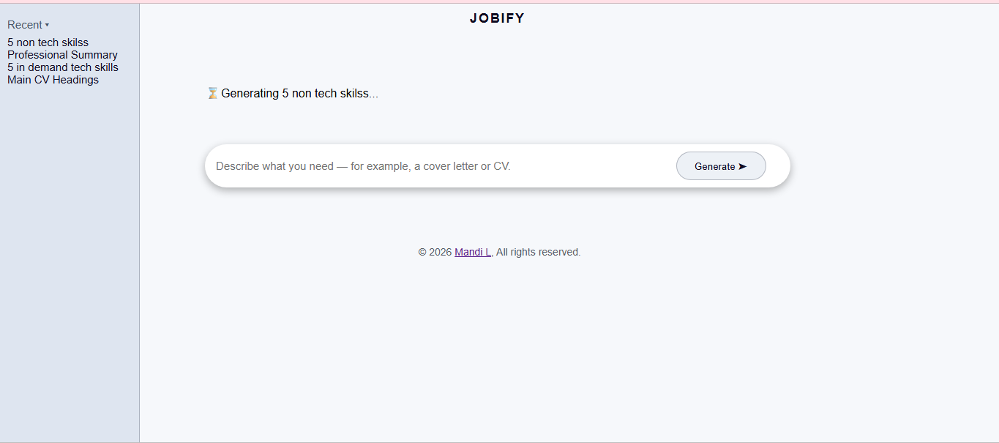
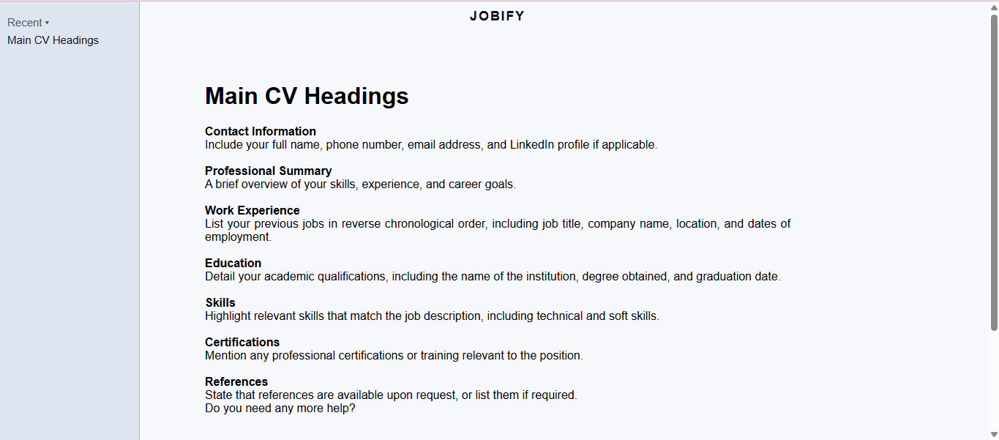

## Jobify

Jobify is an AI-powered job application assistant that helps users generate simple CVs and cover letters through a clean, chat-style interface.

The project focuses on user experience, prompt guidance, and frontend logic — inspired by modern AI tools like ChatGPT and Claude.

## Features

- Generate simple CVs and cover letters using AI
- Chat-style interface with typing animation
- “Try these” prompt suggestions for easy onboarding
- Recent prompt history sidebar
- Clean, minimal UI focused on clarity
- Input clears automatically after submission

## Built With

- HTML
- CSS
- JavaScript
- Axios
- SheCodes AI API

## Project Goals

- Practice building a real-world AI interface
- Improve frontend structure and UX decisions
- Learn how to guide AI output using prompts and context
- Handle user interactions without page reloads

## Current Limitations

- Generates simple CVs and cover letters only
- No user accounts or backend storage
- API key is used client-side (for learning purposes)

## Future Improvements

- Clickable recent prompts to regenerate content
- More tailored CV and cover letter templates
- Better title generation for recent history
- Backend integration for secure API calls
- Option to export or copy generated content

 

📸 Project Preview

  
  
  

